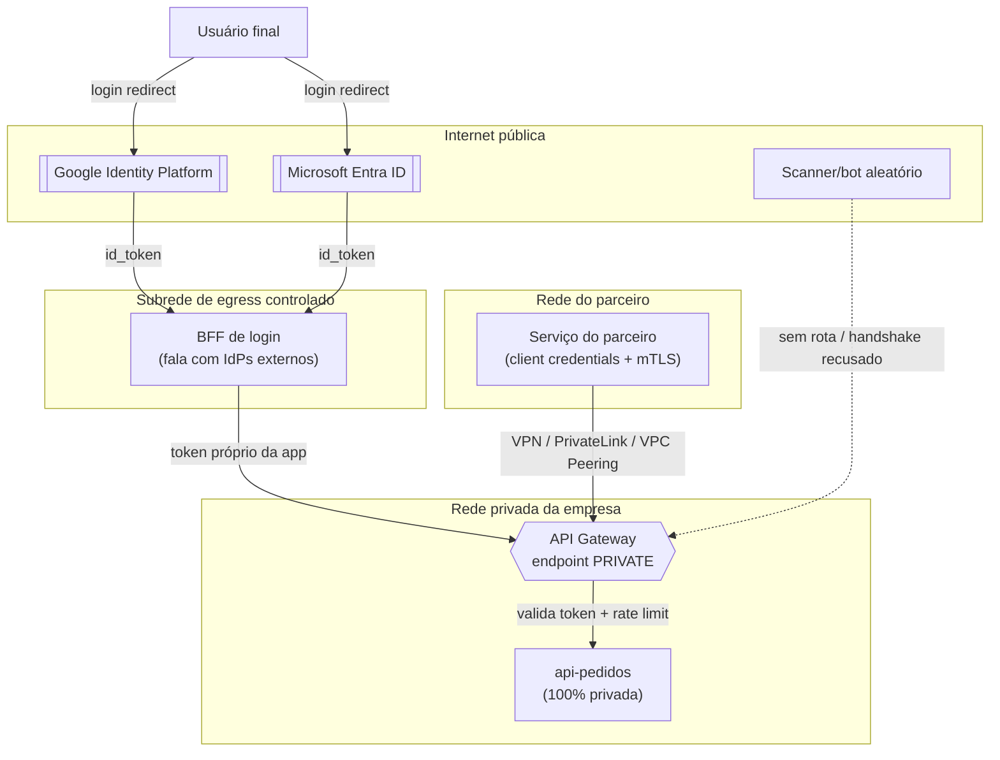

# API Privada Exposta a Parceiros via API Gateway (com login federado Google/Microsoft)

## Contexto / Problema

Uma API interna (ex: `api-pedidos`) roda dentro da rede privada da empresa (VPC própria), sem nunca ter tido
rota para a internet pública. Dois requisitos novos surgem ao mesmo tempo:

1. **Login de usuário via e-mail corporativo ou pessoal**: em vez de a própria API gerenciar senha, o login
   deve delegar a autenticação para um provedor de identidade externo — **Microsoft Entra ID** (contas
   corporativas `@empresa.com`) ou **Google Identity Platform** (contas `@gmail.com`/Workspace). A API nunca
   vê a senha do usuário, apenas recebe um token assinado pelo provedor.
2. **Consumo por serviços de parceiros fora da rede**: sistemas de outras empresas (ou de outras contas
   cloud/VPCs da própria organização) precisam chamar essa API para automações server-to-server — sem que
   isso signifique publicar a API na internet aberta.

O desafio é que esses dois requisitos empurram em direções opostas: "falar com Google/Microsoft" soa como
"a API precisa estar na internet", e "outros serviços fora da rede vão chamar essa API" soa como "preciso
expor uma URL pública". Nenhuma das duas conclusões é obrigatória — dá para atender as duas sem nunca abrir
a API para a internet.

## Requisitos

**Funcionais**
- Usuário final faz login com e-mail (Google ou Microsoft), sem a API armazenar senha.
- Serviços de parceiros autenticados conseguem chamar endpoints da API a partir de fora da rede local.
- A API nunca deve responder a uma requisição vinda diretamente da internet pública.

**Não-funcionais**
- Autenticação de usuário e autenticação de serviço devem ser mecanismos **distintos**, nunca reutilizando o
  mesmo token para os dois propósitos.
- Superfície de ataque mínima: nenhuma porta/endpoint acessível sem passar por um canal de rede privado.
- Auditoria de quem chamou o quê (usuário final vs. qual serviço parceiro).
- Limitar taxa de chamadas por parceiro (evitar que um cliente mal comportado afete os demais).

## Dois fluxos de autenticação que não podem se confundir

### 1. Login do usuário final — delegado a um Identity Provider (IdP) externo

A API **não fala diretamente** com o Google/Microsoft a partir do backend em nome do usuário digitando senha.
O fluxo padrão é o **Authorization Code Flow (OIDC)**:

1. O navegador do usuário é redirecionado para `accounts.google.com` (ou `login.microsoftonline.com`).
2. O usuário autentica lá — a senha nunca passa pela nossa infraestrutura.
3. O IdP redireciona de volta com um `authorization_code`.
4. Um componente **Backend-for-Frontend (BFF)** troca esse código por um `id_token` (JWT) diretamente com o
   IdP, usando um `client_secret` que fica só no backend (nunca no navegador/app mobile).
5. O BFF cria a sessão da aplicação e, a partir daí, toda chamada à API interna carrega um token **próprio da
   aplicação** (JWT assinado por nós, ou opaco validado por introspecção) — não o token do Google/Microsoft.

O único componente que precisa de saída para a internet (para falar com os endpoints OIDC do Google/Microsoft)
é o **BFF**, que fica em uma subrede com NAT Gateway/egress controlado. A API de domínio em si (`api-pedidos`)
segue 100% privada, nunca precisa de rota de saída para a internet nem de rota de entrada a partir dela.

### 2. Autenticação de serviço parceiro — client credentials ou mTLS, nunca o login do usuário

Parceiro é uma aplicação, não uma pessoa. O padrão de mercado é **OAuth2 Client Credentials Flow** (o parceiro
troca `client_id` + `client_secret` por um `access_token` de curta duração num Authorization Server interno,
ex: Entra ID App Registration, Auth0, Keycloak, ou o próprio Cognito) combinado, opcionalmente, com **mTLS**
(certificado de cliente emitido para aquele parceiro especificamente) para uma segunda camada de garantia de
identidade no nível de transporte, independente do token.

## Como expor a API a "fora da rede" sem torná-la pública

### Opção 1: API Gateway público, protegido por API Key + WAF
O Gateway recebe um endpoint HTTPS público normal; cada parceiro ganha uma API Key, e uma WAF na frente filtra
tráfego malicioso (rate limiting, bloqueio de IP, regras contra payloads suspeitos).
- **Prós**: simples de integrar (qualquer parceiro só precisa de internet), não depende de acordos de rede
  bilaterais, fácil de escalar para muitos parceiros pequenos.
- **Contras**: a superfície de ataque é a internet inteira — qualquer scanner/bot pode alcançar o endpoint,
  mesmo que não tenha credenciais válidas; uma API Key vazada (log, repositório público, client-side) vira
  acesso direto de qualquer lugar do mundo; exige WAF, rate limiting agressivo e rotação de chaves como
  disciplina constante para compensar a exposição.

### Opção 2: API Gateway privado, acessível só por canal de rede controlado
O Gateway é criado **sem endpoint público** — só responde a tráfego que chega através de um canal de rede
específico:
- **VPN Site-to-Site** ou **AWS Direct Connect / Azure ExpressRoute** até a rede do parceiro; ou
- **PrivateLink / VPC Peering** quando o parceiro também está na mesma nuvem, expondo o Gateway como um
  **endpoint de interface privado** que só existe dentro de VPCs explicitamente autorizadas; ou
- **VPC Link** (AWS) ligando o API Gateway a um NLB dentro da VPC privada — o Gateway em si pode ter um DNS
  resolvido apenas internamente (`PRIVATE` endpoint type), nunca em `*.execute-api.<region>.amazonaws.com`
  público.

Autenticação e autorização continuam existindo (client credentials/mTLS) — a rede privada não substitui a
identidade, ela **elimina a superfície de ataque da internet aberta**, que é a camada anterior a qualquer
autenticação.
- **Prós**: nenhum scanner de internet consegue sequer completar o handshake TCP com o Gateway; uma credencial
  vazada sozinha não basta — o atacante também precisaria estar dentro de uma rede peered/conectada por VPN;
  reduz drasticamente o raio de exposição a vulnerabilidades de dia zero do próprio Gateway.
- **Contras**: onboarding de cada novo parceiro exige um passo de rede (aprovar peering, configurar VPN, criar
  endpoint de interface) além do cadastro de credenciais — não é só "gerar uma API Key e mandar por e-mail";
  não escala bem para centenas de parceiros pequenos e não controlados (cada um exige uma negociação/latência
  de setup de rede); exige inventário e revisão periódica de quais VPCs/túneis têm permissão de alcançar o
  endpoint.

## Decisão

Opção 2: **API Gateway privado** (`PRIVATE` endpoint type + VPC Link/PrivateLink), acessível apenas a partir
de VPCs de parceiros explicitamente autorizadas (allowlist na resource policy do Gateway) ou por VPN
Site-to-Site para parceiros fora de nuvem. A validação de identidade acontece em duas camadas independentes:
**rede** (só quem está no canal privado chega ao Gateway) e **aplicação** (token OAuth2 client credentials,
com mTLS para os parceiros de maior criticidade). O login de usuário final via Google/Microsoft passa por um
BFF separado, que é o único componente com rota de saída para a internet.

## Trade-offs

- **Ganha-se**: a API nunca aparece em um scan de portas da internet; comprometer uma credencial sozinha não
  é suficiente para um atacante externo alcançar o endpoint; a separação BFF (fala com IdPs externos) vs. API
  de domínio (100% privada) limita qual componente pode ser o ponto de entrada de um ataque vindo de fora.
- **Abre-se mão de**: velocidade de onboarding de novos parceiros (cada um exige um passo de infraestrutura de
  rede, não só uma credencial); simplicidade operacional — a equipe de plataforma precisa manter e auditar o
  inventário de peerings/VPNs/endpoints autorizados; parceiros muito pequenos ou pouco maduros tecnicamente
  podem ter dificuldade em estabelecer VPN/PrivateLink, exigindo eventualmente uma exceção controlada (ex: um
  Gateway público separado, com escopo bem mais restrito, só para esse perfil de parceiro).

## Vantagens de expor via API Gateway (independente de público/privado)

- **Ponto único de autenticação/autorização**: validação de JWT (issuer, audience, expiração, JWKS) e de
  client credentials centralizada — o backend real não reimplementa isso em cada serviço.
- **Rate limiting e quotas por cliente**: protege o backend de um parceiro (ou usuário) mal comportado
  consumir capacidade além do combinado.
- **Desacoplamento de contrato**: o backend pode evoluir/versionar (`v1`, `v2`) sem quebrar os parceiros,
  o Gateway roteia e pode até transformar payloads.
- **Observabilidade centralizada**: logs, métricas e tracing de toda chamada externa num único lugar,
  independente de quantos serviços internos compõem o backend.
- **Superfície de ataque reduzida para o backend real**: só o Gateway "aparece" para o mundo externo
  (ou para a rede privada); os serviços internos não precisam de security groups abertos além do Gateway.

## Cuidados a serem tomados

- **Nunca reaproveitar o token de login do usuário (Google/Microsoft) como credencial de serviço** — são
  tokens com público (audience) e ciclo de vida diferentes; misturar os dois quebra o modelo de revogação.
- **Confirmar que o endpoint do Gateway é realmente privado** — no AWS API Gateway, por exemplo, é fácil
  esquecer de trocar o endpoint type de `REGIONAL` (público) para `PRIVATE`; validar isso em toda revisão de
  infraestrutura (IaC + testes automatizados de rede, não só documentação).
- **Resource policy do Gateway com allowlist explícita** de VPC endpoints/VPCs autorizadas — sem isso, um
  Gateway "privado" ainda pode aceitar tráfego de qualquer VPC que descubra o endpoint.
- **Rotação de segredos**: `client_secret` de OAuth e certificados de mTLS dos parceiros precisam de rotação
  programada e de um processo de revogação rápida em caso de comprometimento.
- **JWKS e validação de JWT corretos**: checar `iss`, `aud`, `exp`/`nbf`, e cachear a chave pública do IdP
  respeitando a rotação dela (não fixar a chave para sempre).
- **BFF isolado**: o componente que fala com o Google/Microsoft deve ficar numa subrede separada, com egress
  restrito só aos domínios necessários (`accounts.google.com`, `login.microsoftonline.com`), para que um
  comprometimento ali não vire um pivô direto para a API de domínio.
- **Dados pessoais em log**: e-mail e claims do usuário são dado pessoal (LGPD/GDPR) — mascarar/tokenizar em
  logs do Gateway, e restringir quem acessa esses logs.
- **Auditoria e inventário de acesso**: revisar periodicamente quais parceiros, VPCs e túneis VPN ainda têm
  permissão de alcançar o Gateway — acesso concedido para um projeto encerrado é uma porta esquecida aberta.
- **Latência adicional**: o Gateway é mais um hop de rede; medir o impacto em cenários sensíveis a latência e
  considerar cache de respostas cacheáveis no próprio Gateway.
- **Alta disponibilidade do Gateway**: sendo o único ponto de entrada, precisa de redundância multi-AZ — um
  Gateway privado ainda é um ponto único de falha se mal dimensionado.

## Diagrama

