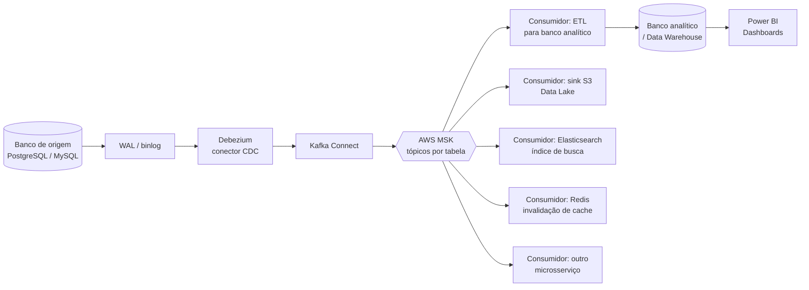

# CDC com Debezium + Kafka (AWS MSK)

## Contexto / Problema

Um sistema legado mantém seu banco de dados transacional (ex: PostgreSQL ou MySQL) como fonte da verdade, mas cada vez mais equipes precisam consumir as mudanças desses dados — dashboards de BI, um data lake para analytics, sincronização de índice de busca, invalidação de cache, outros microsserviços que mantêm sua própria réplica local. Sem um mecanismo dedicado de propagação de mudanças, cada novo consumidor tende a fazer *polling* direto no banco de origem ou depender de *dual writes* na aplicação, aumentando a carga no banco transacional e criando acoplamento direto entre sistemas que deveriam ser independentes.

## Requisitos

**Funcionais**
- Capturar `INSERT`, `UPDATE` e `DELETE` das tabelas configuradas em near real-time.
- Preservar a ordem dos eventos por chave primária de cada tabela.
- Permitir múltiplos consumidores independentes lendo o mesmo fluxo de mudanças, cada um na sua própria velocidade.
- Suportar uma carga inicial (*snapshot*) das tabelas antes de começar a capturar eventos incrementais.

**Não-funcionais**
- Impacto mínimo de performance no banco de origem (sem *polling* pesado nem *table scans* repetidos).
- Entrega *at-least-once*: nenhum evento de mudança pode ser perdido silenciosamente.
- Escalar para dezenas de tabelas e múltiplos schemas sem reescrever a lógica de captura.
- Reter histórico de eventos por um período configurável, permitindo reprocessamento (*replay*) por novos consumidores.
- Observabilidade do lag de replicação (quão atrasado o consumidor está em relação ao banco de origem).

## Opções consideradas

### 1. Polling periódico (query em `updated_at`)
A aplicação ou um job roda periodicamente uma query filtrando por uma coluna de última atualização.
- Prós: simples de implementar, nenhuma infraestrutura nova.
- Contras: latência atrelada ao intervalo de polling; carga extra e crescente no banco de origem; não captura `DELETE` sem soft-delete; risco de *race conditions* entre a leitura e novas escritas.

### 2. Dual write na aplicação
A aplicação escreve no banco e, na mesma transação de negócio, publica um evento na fila/tópico.
- Prós: controle total do payload do evento.
- Contras: não é atômico — se a escrita no banco tiver sucesso e a publicação do evento falhar (ou vice-versa), os sistemas ficam inconsistentes; qualquer novo consumidor exige alterar código de aplicação já existente.

### 3. Change Data Capture via log de transação (Debezium + Kafka Connect + AWS MSK)
Um conector Debezium lê diretamente o log de transação do banco (WAL no PostgreSQL, binlog no MySQL) através do Kafka Connect, publicando cada mudança de linha como um evento em um tópico Kafka dedicado por tabela. O cluster Kafka é o AWS MSK (Managed Streaming for Kafka).
- Prós: captura eventos sem tocar a aplicação nem o banco além de habilitar replicação lógica; baixa latência; desacopla completamente produtores (banco de origem) de consumidores; qualquer novo consumidor apenas assina o tópico, sem exigir mudança em nada existente; MSK reduz o overhead operacional de manter o cluster Kafka.
- Contras: operação do conector tem suas próprias complexidades (gestão de *offsets*, *snapshot* inicial, evolução de schema); exige permissão de replicação lógica no banco de origem; entrega é *at-least-once*, então consumidores precisam ser idempotentes.

## Decisão

Opção 3: CDC via log de transação com **Debezium** rodando sobre **Kafka Connect**, publicando em tópicos no **AWS MSK**. Cada tabela de origem mapeia para um tópico Kafka próprio (ex: `cdc.public.pedidos`), e consumidores dedicados leem esses tópicos para alimentar cada sistema de destino — incluindo um pipeline que grava as mudanças em outro banco de dados (analítico) para consumo via dashboards.

## Trade-offs

- **Ganha-se**: desacoplamento total entre o banco de origem e quem consome as mudanças; qualquer novo consumidor (um novo dashboard, um novo índice de busca, um novo microsserviço) só precisa assinar o tópico existente, sem tocar no banco transacional nem pedir uma nova integração ponto-a-ponto; histórico retido no Kafka permite reprocessar eventos para popular um consumidor novo do zero.
- **Abre-se mão de**: simplicidade operacional — agora há um conector Debezium, um cluster Kafka Connect e o próprio cluster MSK para monitorar, com métricas próprias (lag de replicação, falhas de snapshot, evolução de schema incompatível); a entrega *at-least-once* exige que todo consumidor trate duplicidade (idempotência), o que adiciona complexidade em cada consumidor.
- Snapshot inicial de tabelas grandes pode gerar um pico de carga de leitura no banco de origem no momento em que o conector é criado — mitigado com *snapshot* incremental do próprio Debezium, mas ainda é um custo a ser planejado.

## Exemplos de uso real

- **Dashboards de BI (Power BI)**: um consumidor lê os tópicos CDC e grava as mudanças em um banco/data warehouse analítico (ex: Redshift, SQL Server, Snowflake). O Power BI consulta esse banco de destino via DirectQuery ou import agendado, sem nunca tocar diretamente no banco transacional — evitando que relatórios pesados degradem a performance da aplicação de produção.
- **Data lake para analytics**: um *sink connector* grava os eventos em S3 (Parquet/Iceberg), permitindo consultas via Athena ou processamento em EMR/Spark sem impor carga analítica ao banco OLTP.
- **Sincronização de índice de busca**: os eventos alimentam Elasticsearch/OpenSearch, mantendo o índice de busca sempre atualizado incrementalmente, sem reindexações completas periódicas.
- **Invalidação/atualização de cache**: um consumidor invalida ou atualiza chaves específicas no Redis quando a linha correspondente muda no banco, evitando cache desatualizado sem depender de TTLs curtos.
- **Sincronização entre microsserviços (read model local)**: outro serviço mantém sua própria cópia read-only dos dados de que precisa, sem chamadas síncronas de API ao serviço dono do dado — reduzindo acoplamento e pontos de falha em cascata.
- **Auditoria e compliance**: todo evento de mudança é persistido de forma imutável (ex: S3 + Glacier), atendendo requisitos regulatórios de rastreabilidade de quem alterou o quê e quando, sem precisar instrumentar cada ponto de escrita da aplicação.
- **Detecção de fraude / analytics em tempo real**: eventos de transações fluem para processamento em stream (Kafka Streams, Flink) que aplica regras quase em tempo real, muito mais rápido do que jobs batch noturnos.
- **Feature store para Machine Learning**: eventos de mudança mantêm um feature store atualizado, garantindo que modelos em produção usem features frescas sem depender de ETLs batch.
- **Migração/replicação entre bancos heterogêneos**: usado como mecanismo de migração com downtime mínimo entre bancos diferentes (ex: Oracle → PostgreSQL), mantendo origem e destino sincronizados durante a janela de corte.

## Diagrama

