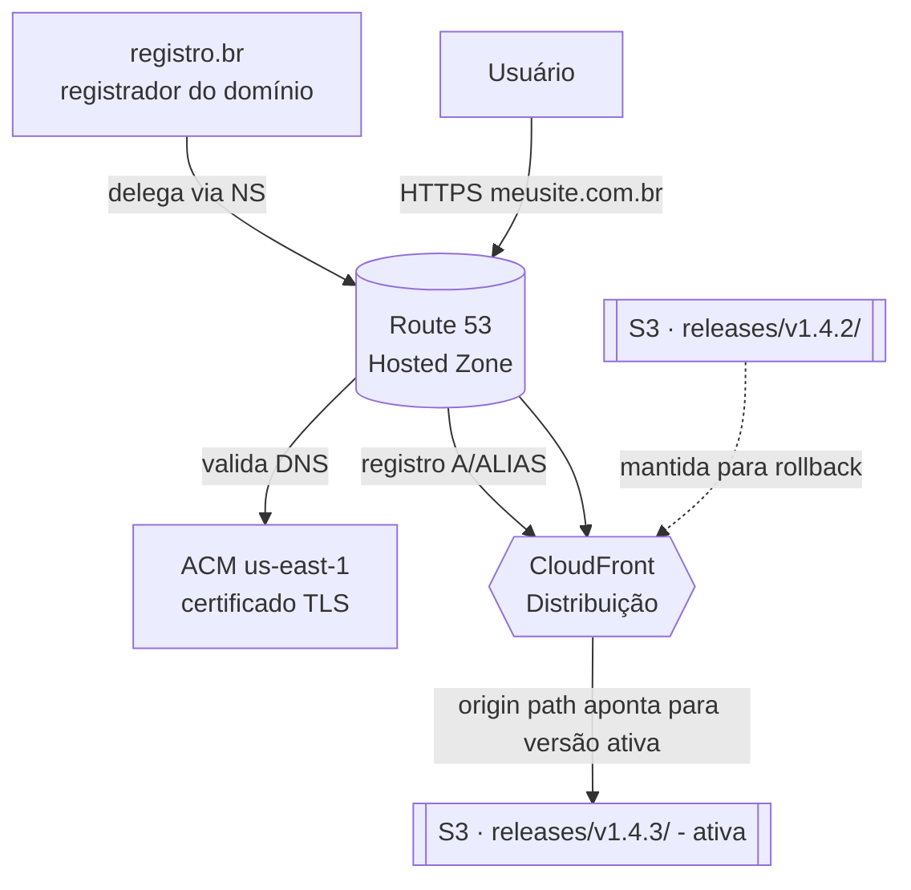

# Site Estático com CloudFront + S3 (domínio próprio via Route 53)

## Contexto / Problema

Um site estático (HTML/CSS/JS já buildado, sem servidor de aplicação) precisa ser publicado na internet com HTTPS, baixa latência para usuários em qualquer região e um domínio próprio (ex: `meusite.com.br`). O domínio foi **comprado no registro.br**, que é o registrador oficial para domínios `.br`, mas a infraestrutura de hospedagem e DNS será toda gerenciada na AWS. Além disso, cada novo deploy do site precisa de uma estratégia clara de versionamento dos arquivos no armazenamento, para permitir rollback rápido sem reprocessar um novo build.

## Requisitos

**Funcionais**
- Servir o site em um domínio próprio com HTTPS válido.
- Cada novo deploy deve poder ser publicado sem downtime perceptível.
- Deve ser possível reverter para uma versão anterior rapidamente em caso de problema.

**Não-funcionais**
- Baixa latência global (usuários no Brasil e fora dele).
- Alta disponibilidade sem precisar gerenciar servidores.
- Custo proporcional ao tráfego (sem pagar por capacidade ociosa).
- Cache eficiente no edge, sem servir conteúdo desatualizado após um deploy.

## Domínio comprado no registro.br, DNS na AWS

O **registro.br** continua sendo o *registrador* do domínio `.br` (é obrigatório para domínios brasileiros) — ele não deixa de ser o "dono" administrativo do registro. O que muda é *quem responde as consultas DNS*: ao invés de usar os DNS do próprio registro.br, o domínio é delegado para os **name servers do Route 53**.

Passo a passo da delegação:
1. Criar uma **Hosted Zone** pública no Route 53 para o domínio (ex: `meusite.com.br`).
2. O Route 53 gera 4 registros `NS` (name servers) próprios da AWS para essa zona.
3. No painel do registro.br, trocar os *DNS* do domínio para esses 4 name servers da AWS.
4. A partir da propagação (pode levar algumas horas), toda consulta DNS para `meusite.com.br` passa a ser respondida pelo Route 53, que pode então ter registros `A`/`ALIAS` apontando para a distribuição CloudFront.
5. Emitir o certificado TLS via **ACM** (obrigatoriamente na região `us-east-1` para uso em CloudFront) usando validação por DNS — o Route 53 já resolve essa validação automaticamente, pois é o dono da zona.

Esse modelo (registrador externo + zona DNS na nuvem escolhida) é extremamente comum: o mercado raramente usa o DNS default do registrador quando a infraestrutura já está em um provedor de nuvem — delegar para o Route 53 (ou Cloudflare, Google Cloud DNS etc.) dá acesso a registros `ALIAS`/roteamento avançado que o DNS básico do registrador não oferece.

## Onde armazenar os arquivos estáticos no bucket: raiz vs. pastas de release

### Opção 1: Arquivos na raiz do bucket, sobrescritos a cada deploy
Cada deploy faz `sync` direto na raiz (`s3://bucket/index.html`, `s3://bucket/assets/*`), sobrescrevendo os arquivos da versão anterior.
- Prós: simples, nenhuma lógica extra de "qual é a versão atual"; CloudFront aponta sempre para a raiz do bucket, sem mudar configuração entre deploys.
- Contras: não há como manter duas versões publicadas simultaneamente; rollback exige refazer o deploy da versão anterior (se não tiver o artefato salvo em outro lugar, é preciso rebuildar); risco de servir uma mistura de arquivos novos e antigos durante o `sync` se o CloudFront buscar do bucket no meio da atualização (mitigado parcialmente com nomes de arquivo com hash, mas o `index.html` em si ainda é sobrescrito "no ar").

### Opção 2: Pastas de release versionadas (`/releases/v1.4.2/`, `/releases/v1.4.3/`)
Cada deploy sobe para uma pasta nova e imutável com o número da versão. Um objeto “ponteiro” (ou a configuração de *origin path* do CloudFront) indica qual pasta é a versão atualmente ativa.
- Prós: toda versão publicada anteriormente continua intacta no bucket — rollback é apenas apontar de volta para a pasta anterior, sem novo build; nenhuma janela de inconsistência, pois a troca de versão é atômica (muda o ponteiro, não os arquivos); permite manter várias versões para auditoria/comparação.
- Contras: mais lógica de deploy (subir para pasta nova + atualizar o ponteiro + invalidar cache); acúmulo de armazenamento com versões antigas (mitigado com lifecycle rules no S3 para expirar releases muito antigas); exige decidir *onde* fica esse ponteiro (objeto separado lido por uma função, `origin path` do CloudFront reconfigurado via IaC/CI, ou uma CloudFront Function que reescreve o caminho da requisição).

## Decisão

Opção 2: **pastas de release versionadas**, com o CI de deploy publicando cada build em `s3://bucket/releases/<versão>/` e atualizando o `origin path` da distribuição CloudFront (via Infra as Code) para apontar para a versão ativa, seguido de uma invalidação de `/*` no CloudFront. Runs antigos ficam retidos por um período configurável via lifecycle rule do S3 antes de serem removidos, permitindo rollback rápido dentro dessa janela.

## Trade-offs

- **Ganha-se**: rollback instantâneo (repontar para a pasta anterior) sem depender de rebuild; nenhuma janela de arquivos mistos durante o deploy, pois a troca é atômica na configuração do CloudFront; histórico de versões publicadas fica auditável no próprio bucket.
- **Abre-se mão de**: simplicidade — o pipeline de deploy precisa de um passo extra para atualizar a referência da versão ativa (seja via IaC, seja via uma camada de roteamento no edge) e monitorar isso passa a ser parte do processo; custo de armazenamento cresce com o número de versões retidas (mitigado com lifecycle rules); cada troca de versão ainda depende de uma invalidação de cache no CloudFront (que tem custo e não é instantânea globalmente).

## Estratégias usadas pelo mercado (mais além de raiz vs. release folders)

- **Nomes de arquivo com hash de conteúdo** (`app.a1b2c3.js`) para todo asset exceto `index.html`: permite cache **imutável e eterno** (`Cache-Control: public, max-age=31536000, immutable`) nesses arquivos, já que qualquer mudança gera um nome novo — só o `index.html` (ou o manifesto de rotas de uma SPA) precisa de cache curto, pois é ele que referencia os hashes mais recentes. É a estratégia padrão gerada por bundlers modernos (Vite, Webpack, etc.) e citada como boa prática pela própria documentação da AWS.
- **Blue/Green via origem dupla**: manter dois buckets (ou dois `origin path`) — "blue" (produção atual) e "green" (nova versão) — e trocar qual é a origem ativa na distribuição CloudFront depois de validar o green em uma URL separada. Reduz ainda mais o risco comparado a apenas trocar uma pasta, pois permite testes end-to-end antes do cutover.
- **Deploy progressivo com múltiplas distribuições/comportamentos**: usar *cache behaviors* do CloudFront para rotear uma pequena porcentagem de tráfego (ou um grupo específico de usuários, via cookie/header) para a versão nova antes do rollout completo — um canary release no edge.
- **Invalidação seletiva em vez de `/*`**: invalidar apenas o `index.html` e os poucos arquivos sem hash no nome, evitando o custo (e a demora) de invalidar todo o cache a cada deploy — só é necessário porque os assets com hash já são versionados por nome.
- **CI/CD dedicado por ambiente**: pastas/buckets separados por ambiente (`releases/staging/`, `releases/prod/`) ou contas AWS separadas, para nunca haver risco de um deploy de staging afetar produção.

## Outros usos reais do CloudFront (além de hospedar site estático)

- **Aceleração de API (dynamic content acceleration)**: CloudFront na frente de um API Gateway/ALB, aproveitando as conexões persistentes e rotas otimizadas da rede da AWS até a origem, mesmo quando o conteúdo não é cacheável.
- **Streaming de vídeo (VOD e live)**: distribuição de vídeo sob demanda ou ao vivo (integrado com MediaPackage/MediaLive), com suporte a *Signed URLs*/*Signed Cookies* para restringir acesso a assinantes.
- **Distribuição de software e atualizações**: instaladores, pacotes de atualização de aplicativos desktop/mobile e imagens de containers, aproveitando cache de longa duração e alta taxa de transferência.
- **Segurança na borda (WAF + Shield)**: CloudFront como ponto de entrada único, integrado a AWS WAF (regras contra SQL injection, bots, rate limiting por IP) e Shield (proteção DDoS), protegendo a origem real de tráfego malicioso antes que ele chegue à aplicação.
- **Lambda@Edge / CloudFront Functions**: lógica executada na borda antes de chegar à origem — redirecionamentos por país/idioma, testes A/B, reescrita de URLs, autenticação leve (checar um cookie/JWT) ou até personalização de resposta sem tocar no servidor de origem.
- **Multi-região com failover de origem**: CloudFront com origem primária e secundária (*origin failover*) apontando para regiões AWS diferentes, aumentando a disponibilidade de uma aplicação crítica sem lógica extra no cliente.
- **Otimização/transformação de imagens na borda**: combinado com Lambda@Edge ou um serviço de otimização, redimensionar/comprimir imagens sob demanda de acordo com o dispositivo do usuário, servindo o resultado já cacheado nas edges seguintes.

## Diagrama

